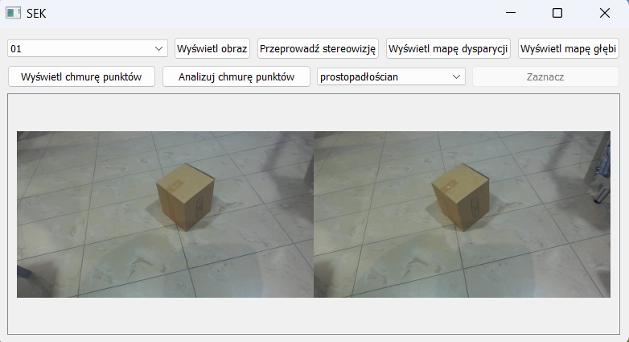
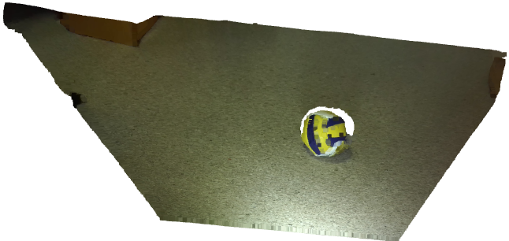
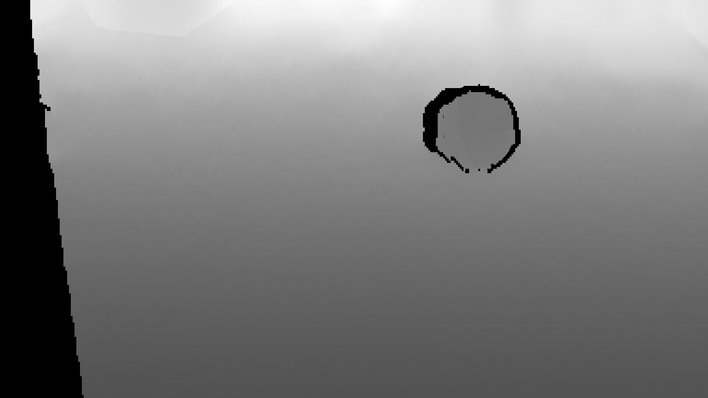
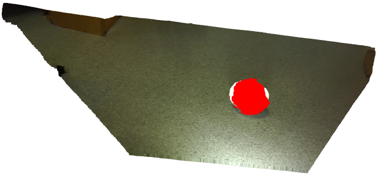
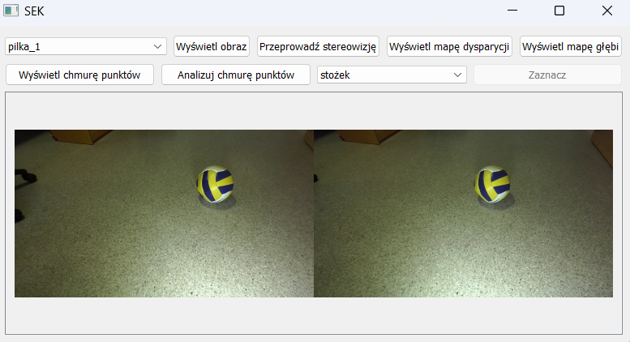

# Projekt inżynierski — System kalibracji i rekonstrukcji sceny 3D z wykorzystaniem widzenia stereoskopowego

## 📖 Opis projektu

Celem projektu inżynierskiego jest implementacja systemu rekonstrukcji sceny 3D przy użyciu zestawu stereoskopowych kamer. System umożliwia kalibrację układu kamer, przetwarzanie obrazów, rekonstrukcję głębi i wizualizację wyników. Projekt oparty jest na bibliotece OpenCV oraz innych narzędziach wspierających przetwarzanie obrazów i analizę danych.

## 📁 Struktura projektu

```
.
├── calibration.py         # Kalibracja pojedynczej kamery – obliczanie ogniskowej, dystorsji, pozycji sensora i zapis parametrów w JSON
├── figures.py             # Segmentacja chmur punktów i rozpoznawanie figur geometrycznych (sfera, walec, stożek, prostopadłościan)
├── helpers.py             # Funkcje pomocnicze dla GUI, obsługa grafiki, interakcji i plików konfiguracyjnych
├── photo.py               # Zapis zdjęć z jednej kamery – wykorzystywane przy kalibracji pojedynczej kamery
├── photo2.py              # Jednoczesny zapis zdjęć z dwóch kamer – przygotowanie danych do stereokalibracji
├── SEK.py                 # Główna aplikacja Systemu Estymacji Kształtów (SEK)
├── stereo.py              # Stereokalibracja – obliczanie macierzy rotacji R i wektora translacji T, zapis do JSON
├── stereovision.py        # Proces stereowizji: rektyfikacja, mapa dysparycji, triangulacja i generowanie chmury punktów
├── imports.txt            # Lista wymaganych importów dla całego projektu
```

## ⚙️ Wymagania

Projekt opiera się na kilku kluczowych bibliotekach do przetwarzania obrazów, wizji komputerowej, analizy danych oraz tworzenia GUI:

- **Python 3.8+**
- **OpenCV-Python** – przetwarzanie obrazów, rektyfikacja, obliczanie mapy dysparycji
- **NumPy** – operacje macierzowe, obliczenia numeryczne
- **PyQt5** – graficzny interfejs użytkownika
- **HDBSCAN** – klasteryzacja punktów chmury, detekcja szumów
- **Scikit-Learn** – dopasowanie figur geometrycznych, analiza chmur punktów
- **Matplotlib** – wizualizacja danych (opcjonalnie)
- **SciPy** – dodatkowe operacje matematyczne (opcjonalnie)

## 🛠 Instalacja

Zalecane jest użycie środowiska wirtualnego:

```bash
python -m venv venv
source venv/bin/activate  # Linux/macOS
venv\Scripts\activate     # Windows
```

Następnie zainstaluj wymagane biblioteki:

```bash
pip install -r imports.txt
```

## 🚀 Uruchomienie aplikacji

Aby uruchomić program, przejdź do katalogu z plikami i wykonaj polecenie:

```bash
python SEK.py
```

> Upewnij się, że wcześniej aktywowałeś środowisko wirtualne i zainstalowałeś wymagane biblioteki.

---

## 🧱 Tworzenie pliku `.exe`

Aby wygenerować plik wykonywalny `.exe`, zainstaluj PyInstaller i uruchom:

```bash
pip install pyinstaller
pyinstaller --onefile --windowed SEK.py
```

Gotowy plik `.exe` znajdziesz w katalogu `dist`.

> Uwaga: Aplikacja korzysta z plików zewnętrznych (np. zdjęcia, kalibracje `.json`), upewnij się, że znajdują się one w odpowiednich ścieżkach.

## 🔧 Funkcjonalności

- Interfejs graficzny (GUI) zbudowany w PyQt5
- Przechwytywanie zdjęć z jednej kamery lub dwóch kamer jednocześnie (tryb stereo)
- Kalibracja pojedynczej kamery (obliczanie parametrów optycznych i zapisywanie ich do pliku)
- Stereokalibracja – obliczanie pozycji i orientacji kamer względem siebie
- Rektyfikacja obrazów stereo i generowanie mapy dysparycji
- Triangulacja – tworzenie chmury punktów 3D na podstawie zdjęć stereo
- Segmentacja chmury punktów i wykrywanie figur geometrycznych (sfera, walec, stożek, prostopadłościan)
- Możliwość wizualizacji wyników bezpośrednio w aplikacji
- Obsługa konfiguracji i zapisów parametrów w formacie JSON

## 🖼️ Widok aplikacji

Poniżej przedstawiono interfejs graficzny (GUI) aplikacji SEK:



---

## 📊 Przykładowe wyniki

### 🔵 1. Chmura punktów 



---

### 🌀 2. Mapa głębi



---

### 🟡 3. Detekcja sfery 



---

### 🖼️ Alternatywny widok aplikacji 



## 🧠 Autor
Projekt inżynierski wykonany przez:

**Przemysław Piątkiewicz**  
Politechnika Gdańska, Wydział Elektroniki, Telekomunikacji i Informatyki  
Rok akademicki 2023/2024

## 📄 Licencja

Kod źródłowy projektu jest udostępniony na licencji MIT.  
Treść pracy (PDF) objęta jest licencją Creative Commons Attribution-NonCommercial 4.0 International (CC BY-NC 4.0).
