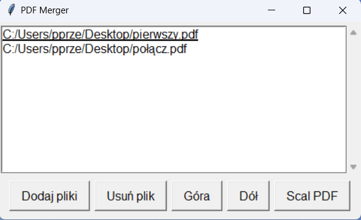

# PDF Merger

PDF Merger to prosta aplikacja GUI do łączenia plików PDF, napisana w Pythonie z użyciem bibliotek Tkinter i PyPDF2.

## Wymagania

- Python 3.x
- PyPDF2

Możesz zainstalować wymagane biblioteki za pomocą komendy:

```bash
pip install -r requirements.txt
```

## Uruchomienie aplikacji

Aby uruchomić program, przejdź do katalogu `PDFmerger` i wykonaj polecenie:

```bash
python PDF_Merger.py
```

## Tworzenie pliku .exe

Aby wygenerować plik wykonywalny `.exe`, zainstaluj PyInstaller i użyj poniższej komendy:

```bash
pip install pyinstaller
pyinstaller --onefile --windowed PDF_Merger.py
```

Gotowy plik `.exe` pojawi się w katalogu `dist`.

## Funkcjonalności

- Wybór wielu plików PDF do połączenia.
- Zmiana kolejności plików za pomocą przycisków.
- Usuwanie wybranych plików.
- Suwak przewijania przy dużej liczbie plików.
- Zapisywanie scalonego pliku PDF w wybranej lokalizacji.

## Widok Aplikacji


## Autor
Przemysław Piątkiewicz

## Licencja
Ten projekt jest udostępniany na licencji MIT.
