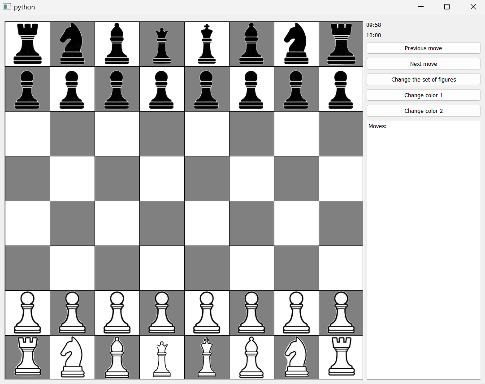
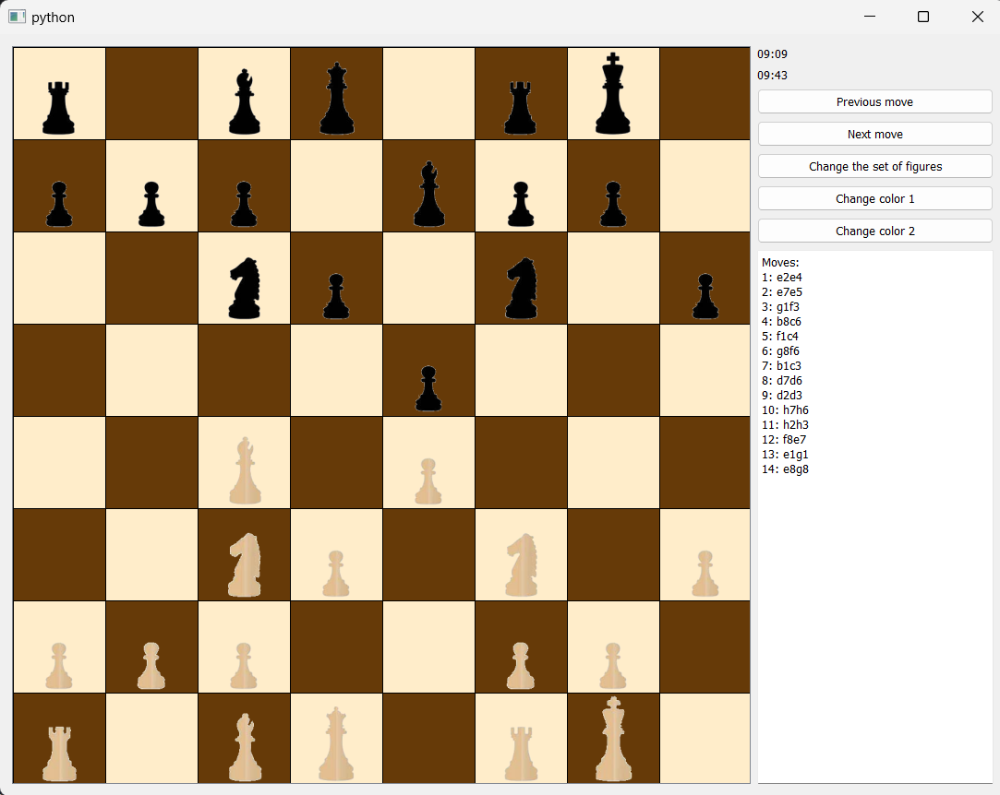
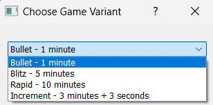
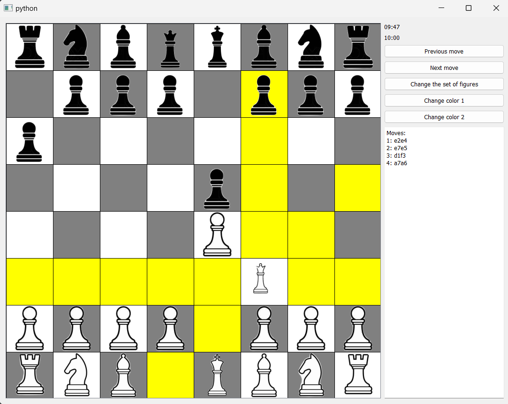

# Chess Game

Welcome to my Chess Game, a fully interactive digital chess experience built with PyQt5. This project consists of three main modules that handle everything from the graphical user interface to the game mechanics.

## Modules

1. **main.py**: This is the core file of the game, where the main application is run. It includes the rules of the game and sets up the graphical user interface (GUI). It utilizes PyQt5 to manage game windows, dialogs, and other GUI components.

2. **figures.py**: This file contains the definitions of the chess pieces and classes related to piece promotion and reviewing past moves. It plays a crucial role in defining the behavior of each piece on the chessboard.

3. **resources_rc.py**: This module handles the graphical resources, storing representations of the chess pieces used in the game's GUI.

## Dependencies

To run this game, you will need Python and PyQt5. Here's how you can install PyQt5 if you haven't done so yet:

```bash
pip install PyQt5
```
## Running the game

To start the game, navigate to the directory containing the game's files and run the following command:
``` bash
python main.py
```


## Gameplay

The game adheres to standard chess rules, allowing players to move pieces by clicking and dragging them to different squares. It features various interactive elements that enhance the player's experience:


- **Standard Game View**: The traditional game view presents a clear and intuitive interface, allowing players to focus on the game without unnecessary distractions. Below is the standard view of the game interface.
  
  
- **Background and Piece Customization**: Players can personalize their game by changing the background color and the set of figures to suit their preferences, providing a fresh visual experience. The interface below demonstrates a customized look with a new set of pieces and background color.
  

- **Game Options**: Before starting a match, players can choose their desired game settings, such as the time control. These include fast-paced Bullet and Blitz formats, traditional Rapid, or Increment time modes to accommodate different styles of play.
  

- **Move Assistance**: To help players consider their options, the game visually highlights potential moves for the selected piece. This feature aids new players in understanding possible moves and strategizing accordingly.
  

  - **Game Review**: After completing a game, players have the opportunity to reflect on and analyze their gameplay. This can be accomplished by navigating through each move made during the game using the 'Next move' and 'Previous move' buttons. This functionality provides a platform for detailed post-game analysis, enabling players to learn from their games.

- **Move List**: Throughout the game, all moves are recorded and displayed in a dedicated section of the interface. This feature serves as a move history log, allowing players to keep track of the game's progress, review the actions taken, and refine their strategies for future games.


## Author

Piątkiewicz Przemysław

## License

This project is open-source and available under the MIT License.

