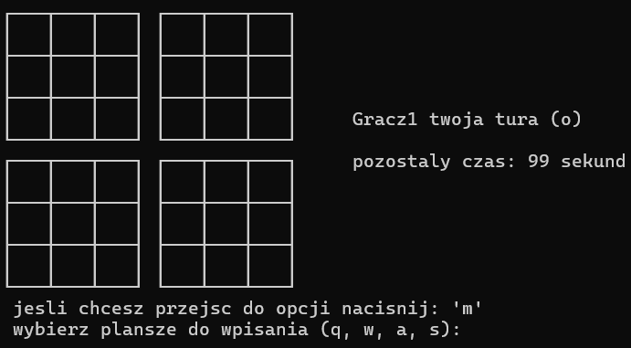
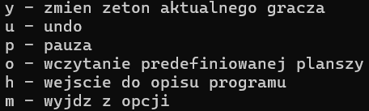
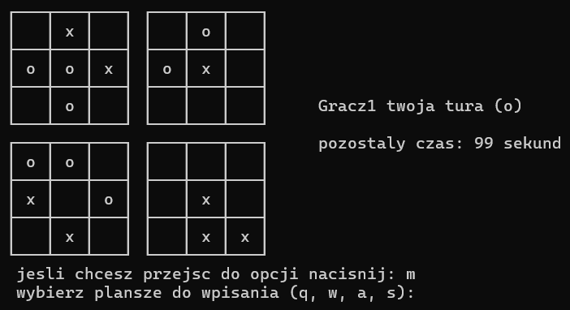
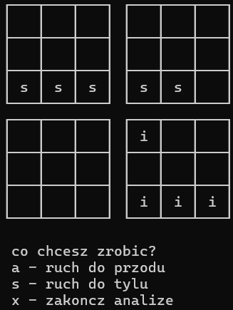

# Gra Pentago

**Pentago** to strategiczna gra planszowa dla dwóch graczy, której celem jest ułożenie pięciu swoich znaków w rzędzie. Gra wykorzystuje obrotowe sektory planszy, co dodaje dodatkową warstwę taktycznego planowania.

## Wymagania Systemowe
- System operacyjny: Windows, Linux lub MacOS
- Kompilator: Zgodny z C++, np. GCC, Clang, MSVC

## Kompilacja i Uruchomienie
Aby skompilować grę, potrzebny jest kompilator obsługujący standard C++11 lub nowszy. Przykładowe polecenie kompilacji dla GCC:
```bash
g++ -std=c++11 -o pentago main.cpp
```
Aby uruchomić grę, wystarczy wykonać skompilowany plik:
```bash
./pentago
```

## Zasady Gry
1. Przed rozpoczęciem gry, gracze wpisują swoje imiona i wybierają czas rozgrywki dla każdego z graczy.
2. Gracze wybierają znak, którym będą grać ('o' lub 'x'), przy czym znaki nie mogą być takie same.
3. Plansza składa się z czterech kwadrantów, każdy zawiera 3x3 pola.
4. Gracze na przemian umieszczają swoje znaki na dowolnym wolnym polu.
5. Po wykonaniu ruchu (dodaniu znaku), gracz musi wybrać jeden z kwadrantów i obrócić go o 90 stopni w lewo lub w prawo.
6. Wygrywa gracz, który jako pierwszy ułoży pięć swoich znaków w rzędzie (pionowo, poziomo lub na skos) na całej planszy.

## Widok Gry


## Opcje Dodatkowe

- **Zmiana znaku**: Gracze mogą zmieniać znak, którym grają w trakcie gry.
- **Cofanie ruchu (Undo)**: Możliwość cofnięcia ruchu do poprzedniego stanu.
- **Pauza**: Gracze mogą zatrzymać grę na czas nieokreślony.
- **Predefiniowana plansza**: Możliwość wczytania predefiniowanej konfiguracji planszy.

## Interakcja z Graczem
Gra komunikuje się z użytkownikiem poprzez konsolę, gdzie gracze wprowadzają swoje ruchy oraz wybierają opcje. Tekst jest jasny i prosty, co ułatwia zrozumienie bieżącego stanu gry. Przed rozpoczęciem gry, gracze są proszeni o podanie swoich imion, wybór czasu gry oraz znaku, którym będą grać.

## Przeglądanie partii po zakończeniu gry


Po zakończeniu rozgrywki w Pentago, gracze mają możliwość przeglądania wykonanych ruchów. Ta funkcja pozwala analizować przebieg gry krok po kroku, co jest szczególnie przydatne dla nauki i poprawy swoich strategii. Dzięki tej opcji można dokładnie zobaczyć, jakie ruchy prowadziły do zwycięstwa lub porażki, co umożliwia lepsze zrozumienie i przyswojenie taktyk gry.

Zaimplementowany system przeglądania partii jest intuicyjny w obsłudze – po zakończeniu gry wystarczy skorzystać z odpowiednich komend konsoli, aby przeglądać ruchy w przód i w tył. Każdy ruch może być szczegółowo analizowany, co pozwala na głębokie zrozumienie i refleksję nad własnymi decyzjami oraz strategią przeciwnika.
## Autor

Przemysław Piątkiewicz

## Licencja

Ten projekt jest udostępniany na licencji MIT. Szczegóły znajdziesz w pliku `LICENSE`.

